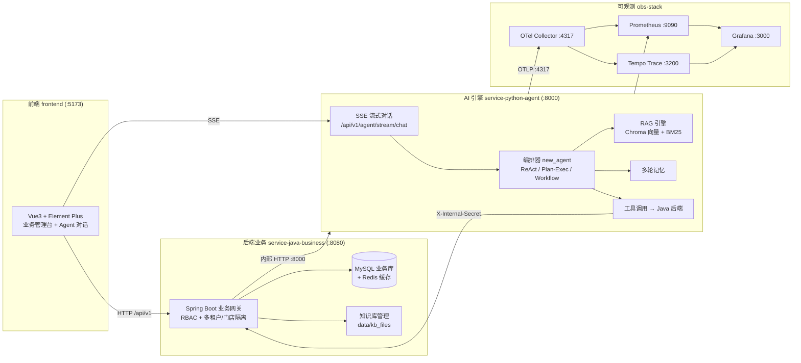

# Retail SaaS Agent

> 零售行业多租户 SaaS 业务管理平台 + AI 智能体（Agent）底座
>
> 以 Java 业务网关为数据中枢、Python AI Agent 为智能引擎、Vue 前端为交互入口，构建「业务系统 + 对话式智能助手」一体化的企业级解决方案。

---

## 一、项目简介

本项目是一套**零售多租户 SaaS + 通用 AI Agent 框架**，采用前后端分离 + 异构微服务架构：

- **后端业务**：以 Spring Boot 实现多租户、多门店隔离的完整零售业务域（商品、订单、会员、促销、库存、报表等），并作为 **Agent 的数据与工具中枢（SSOT）**，为 AI 提供统一的数据访问与权限校验能力。
- **AI 引擎**：以 FastAPI 实现的通用 Agent 框架，内置 **RAG 检索增强生成、LLM 工具调用、多轮记忆、流式编排（ReAct/Plan-Exec/Workflow）**，通过 SSE 流式接口对外服务。
- **交互前端**：Vue 3 + Element Plus 的零售业务管理台 + Agent 对话界面。
- **可观测体系**：基于 OpenTelemetry（OTel）打通 Trace / Metrics / Logs，配套 Grafana 统一大盘。



---

## 二、技术栈

| 模块 | 技术 | 版本 |
|------|------|------|
| **后端** | Java / Spring Boot / Spring Web | 17 / 3.2.5 |
| | MyBatis-Plus（多租户自动过滤、逻辑删除、枚举处理） | 3.5.6 |
| | MySQL | 8.x |
| | Redis（缓存 / 会话） | — |
| | Sa-Token（JWT 鉴权 + 权限） | 1.37.0 |
| | MapStruct（编译期实体↔DTO 转换） / Lombok / Hutool | 1.5.5.Final / — / 5.8.27 |
| **AI 引擎** | Python / FastAPI / Uvicorn | 3.x / 0.110.0 / 0.27.1 |
| | SSE（流式对话） / Pydantic / httpx / Redis | sse-starlette 2.0.0 |
| | Chroma 向量库 / BM25（jieba 分词）/ NumPy | — |
| | OpenTelemetry SDK + FastAPI/httpx/Redis 插桩 | 1.33.0 / 0.54b0 |
| **前端** | Vue / Vite / TypeScript | 3.4 / 5.2 / 5.3 |
| | Element Plus / Pinia / Vue Router / ECharts | 2.7 / 2.1 / 4.3 / 5.5 |
| **可观测** | OTel Collector / Tempo / Prometheus / Grafana（obs-stack） | 0.103.0 / 2.5.0 / 2.53.0 / 11.1.0 |

---

## 三、目录结构

```
retail_saas_agent/
├── service-java-business/        # 后端业务服务（Spring Boot, :8080）
│   ├── src/main/java/com/retail/
│   │   ├── business/             # 零售业务域（商品/会员/订单/促销/库存/报表/知识库…）
│   │   └── rbac/                 # 权限体系（用户/角色/菜单/门店，Sa-Token 多租户）
│   ├── src/main/resources/
│   │   ├── application.yml       # 核心配置（数据源/Redis/多租户/门店隔离/文件上传）
│   │   └── sql/retail_business.sql  # 数据库初始化脚本
│   └── data/kb_files/            # 知识库种子文档（启动时幂等灌入）
├── service-python-agent/         # AI 引擎（FastAPI, :8000）
│   ├── main.py                   # 唯一启动入口，SSE 流式接口
│   ├── new_agent/                # 当前活跃编排器（对象化重构版，复刻 Unified 行为）
│   ├── agent/ other_agent/ unified_agent/ flow_architecture/  # 历史/演进版本
│   ├── config/                   # 分层配置（base/llm/storage/observability）
│   ├── rag/  memory/  tool/  skill/  api/  core/  infra/
│   ├── requirements.txt
│   └── data/                     # 运行时数据（chroma/ bm25/，不入库）
├── frontend/                     # 前端管理台（Vite, :5173）
│   └── src/views/                # 页面：系统管理 / 业务管理 / Agent 对话 / 知识库 / 大盘
├── obs-stack/                    # 可观测：OTel Collector + Tempo + Prometheus + Grafana
└── otel-lgtm/                    # 轻量可观测替代方案（Grafana LGTM 一体镜像）
```

> **说明**：`service-python-agent` 下存在多个 Agent 实现目录（`agent` / `new_agent` / `other_agent` / `unified_agent` / `flow_architecture`），当前**活跃编排器锁定为 `new_agent`**（见 [main.py](file:///c:/Users/JoFend/Desktop/Agent%20Project/retail_saas_agent/service-python-agent/main.py) 顶部注释），其余为历史演进版本，作为参考保留。

---

## 四、核心功能

### 后端业务（Java）
- **RBAC 权限体系**：用户 / 角色 / 菜单 / 门店，Sa-Token 鉴权 + 动态权限校验
- **多租户隔离**：MyBatis-Plus `TenantLineInnerInterceptor` 自动注入 `tenant_id`
- **多门店隔离**：`store_id` 白名单机制自动过滤门店数据
- **零售业务域**：商品（分类 / SKU / 评价）、会员（标签 / 积分）、订单、促销、优惠券、退款、库存、报表、统计
- **知识库管理**：文档上传（多文件 + 类型/大小管控）、列表检索，支撑下游 RAG
- **Agent 支撑**：作为工具调用 SSOT，向 Python 提供统一数据访问；`X-Internal-Secret` 内部鉴权

### AI 引擎（Python）
- **流式对话**：`/api/v1/agent/stream/chat`（SSE），编排器承载全生命周期
- **HITL 人工审批**：破坏性工具调用需人工确认，`/api/v1/agent/stream/resume` 恢复
- **RAG 检索增强**：Chroma 向量 + BM25 关键词混合检索 + 融合（RRF）+ 重排序
- **多轮记忆**：会话短期记忆 + 长期记忆（按类别槽位、置信度入库、巩固）
- **工具调用**：动态加载 Java 后端工具定义（启动同步 SSOT），LLM 决策调用
- **编排范式**：ReAct / Plan-Exec / Workflow 多范式路由
- **可观测**：OpenTelemetry 全链路 Trace + 业务 Metrics

### 前端
- 登录鉴权、动态菜单路由、个人中心
- 系统管理（用户 / 角色 / 门店 / 租户 / 菜单 / 字典 / 配置 / 操作日志）
- 业务管理（商品 / 会员 / 订单 / 促销 / 优惠券 / 积分 / 退款 / 库存 / 报表）
- Agent 智能对话 + 知识库管理 + 数据大盘

---

## 五、快速开始

### 5.1 前置依赖

| 依赖 | 说明 |
|------|------|
| JDK 17+ | 后端运行环境 |
| Maven 3.8+ | 后端构建 |
| Python 3.9+ | AI 引擎 |
| Node.js 18+ | 前端 |
| MySQL 8.x | 业务数据 |
| Redis | 缓存 / 会话 / Agent 状态持久化 |
| Docker + Docker Compose | 可观测体系（可选） |

### 5.2 数据库初始化

```bash
# 创建数据库
CREATE DATABASE retail_business DEFAULT CHARACTER SET utf8mb4;

# 导入初始化脚本（表结构 + 种子数据）
mysql -uroot -p retail_business < service-java-business/src/main/resources/sql/retail_business.sql
```

### 5.3 启动后端（Java, :8080）

```bash
cd service-java-business

# 1) 按需修改 src/main/resources/application.yml 的数据源 / Redis 配置
# 2) 构建并启动
mvn spring-boot:run
```

### 5.4 启动 AI 引擎（Python, :8000）

```bash
cd service-python-agent

# 1) 安装依赖
pip install -r requirements.txt

# 2) 配置环境变量（参考 .env 模板；不泄露真实密钥，从 .env 读取）
#    LLM_API_KEY / LLM_BASE_URL / LLM_MODEL / INTERNAL_SECRET /
#    Redis 地址 / Java 基地址 / OTel 导出地址 等

# 3) 启动（启动时会 fail-fast 校验必配项，缺失会阻止启动）
uvicorn main:app --host 127.0.0.1 --port 8000
```

> 启动会同步 Java `/tools/registry` 工具定义并执行 LLM / 内部密钥等配置校验；Java 不可用时降级不阻断启动。

### 5.5 启动前端（:5173）

```bash
cd frontend

npm install
npm run dev        # 开发模式，代理 /api → http://127.0.0.1:8080
# npm run build    # 生产构建（vue-tsc 类型检查 + vite build）
```

### 5.6 启动可观测体系（可选）

```bash
# 方案一：完整可观测栈（OTel Collector + Tempo + Prometheus + Grafana）
cd obs-stack && docker compose up -d

# 方案二：轻量一体镜像（Grafana LGTM）
cd otel-lgtm && docker compose up -d
```

---

## 六、服务端口与访问地址

| 服务 | 地址 | 说明 |
|------|------|------|
| 后端业务 | http://localhost:8080 | Spring Boot 业务网关 |
| AI 引擎 | http://localhost:8000 | FastAPI；`/health` 探活 |
| 前端 | http://localhost:5173 | Vite Dev Server |
| OTel Collector | :4317 / :4318 / :8889 | OTLP gRPC / HTTP / Prom exporter |
| Tempo | http://localhost:3200 | Trace 查询（经 Grafana） |
| Prometheus | http://localhost:9090 | 指标 |
| Grafana | http://localhost:3000 | 大盘（obs-stack 默认 `admin/admin`） |
| Redis | :6379（RedisInsight :8001） | 缓存 / 会话 |

---

## 七、AI 引擎 API 概览

| 方法 | 路径 | 说明 |
|------|------|------|
| POST | `/api/v1/agent/stream/chat` | 流式对话（SSE） |
| POST | `/api/v1/agent/stream/resume` | HITL 审批恢复（SSE） |
| GET | `/api/v1/agent/tools` | 已注册工具列表（调试） |
| GET | `/api/v1/agent/skills` | 已注册 Skill 列表（调试） |
| GET | `/api/v1/agent/metrics` | 内存指标快照（调试） |
| GET | `/metrics` | Prometheus exposition 格式指标 |
| GET | `/health` | 健康检查 |

> 另含 Java → Python 内部服务接口（知识库同步 / 文件解析 / 记忆抽取），仅供后端内部调用，通过 `X-Internal-Secret` 鉴权。

---

## 八、配置与安全说明

- **密钥不入库**：`service-python-agent/.env` 与 `.env.prod` 包含 `LLM_API_KEY`、`INTERNAL_SECRET` 等敏感项，已被 `.gitignore` 排除，**必须从本地 `.env` 读取**。
- **内部调用鉴权**：Python 回调 Java 使用 `X-Internal-Secret` 建立临时登录态，避免透传用户 Token，仅限内网。
- **生产环境**：建议关闭知识库种子灌入开关（`kb.seed.enabled=false`），并将 `APP_ENV=prod` 读取 `.env.prod`。
- **多租户/门店隔离**：数据访问由拦截器自动注入过滤条件，业务侧无需手动拼 SQL。

---

## 九、常见问题

- **后端启动失败**：检查 MySQL / Redis 连接配置，及是否已执行数据库初始化脚本。
- **Python 启动报 `FATAL`**：为启动前配置校验，按提示补齐 `LLM_API_KEY`、`INTERNAL_SECRET` 等必配项。
- **前端接口 404**：确认后端端口与 `vite.config.ts` 代理 `target` 一致（默认 `http://127.0.0.1:8080`）。
- **Trace 看不到**：确认 `obs-stack` 已启动且 Python 的 OTel 导出地址指向 `127.0.0.1:4317`。
